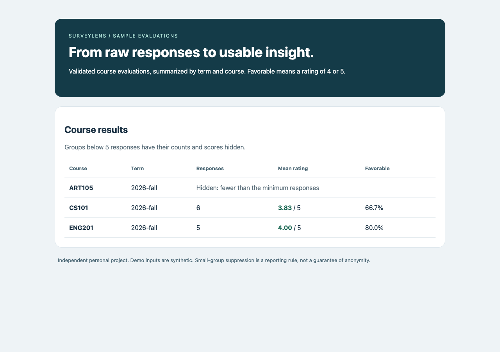
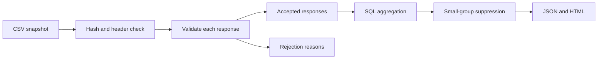

# SurveyLens

[](https://github.com/grantmaye/Survey-Quality-Pipeline/actions/workflows/ci.yml)

**A Python data pipeline that makes survey reporting reproducible.**

Import evaluation CSVs into SQLite, quarantine invalid records, prevent duplicate responses, and produce JSON and HTML reports. Results for small groups are suppressed using a configurable threshold.

Independent personal portfolio project. All sample responses, courses and identifiers are synthetic. No employer code, student information, or real evaluation data is included.



## Run it

Requires **Python 3.11 or later**. Runtime and tests use only the standard library; there is no package installation step when running from the repository.

```sh
python3 -m unittest discover -s tests -v
python3 -m surveylens demo
```

Open `demo-output/report.html` in a browser. The demo uses a temporary database and exports its report into `demo-output/`.

```text
13 accepted responses
1 exact duplicate skipped
3 invalid/conflicting records quarantined
CS101: 6 responses, mean 3.83, favorable 66.7%
ENG201: 5 responses, mean 4.00, favorable 80.0%
ART105: count and scores hidden below the threshold
```

The checked-in [sample HTML](examples/output/report.html) and [sample JSON](examples/output/report.json) were generated from the included fixture. On Windows, use `py -3` in place of `python3` if needed.

## What it demonstrates

Typed Python functions, dataclasses, CSV parsing, validation, exception handling, SQLite transactions, SQL aggregation, command-line design, HTML escaping, package structure, and automated failure-path tests.



## Persistent workflow

```sh
python3 -m surveylens ingest surveylens/data/evaluations.csv --db data/surveys.sqlite
python3 -m surveylens report --db data/surveys.sqlite --output reports --minimum 5
```

Repeat the import to see `replayed: true`. Import receipts preserve the original counts. A byte-for-byte identical file is recognized by its SHA-256 hash; different files still use response IDs to prevent double-counting.

Optional installation into a virtual environment:

```sh
python3 -m venv .venv
. .venv/bin/activate
python -m pip install .
surveylens demo
```

Installation may download the setuptools build tool; direct module execution needs no network access. Sample data is included in the installed package.

## Data contract

The CSV must contain exactly these headers, in any order:

```csv
response_id,course,term,rating,submitted_at
r001,CS101,2026-fall,5,2026-09-20T10:00:00Z
```

| Field | Rule |
| --- | --- |
| `response_id` | Stable answer ID, 1–80 letters/digits/underscores/hyphens; do not use a person's name or email |
| `course` | 1–40 letters/digits/dots/underscores/hyphens; normalized to uppercase |
| `term` | `20YY-spring`, `20YY-summer`, or `20YY-fall`; normalized to lowercase |
| `rating` | Integer 1–5 |
| `submitted_at` | ISO datetime with an explicit timezone; normalized to UTC |

Input size is capped at 25 MiB. The file is read once into a bounded snapshot so hashing and parsing refer to the same bytes. CSV records above the Python CSV parser's field-size limit fail the whole import.

### Failure and duplicate behavior

- An invalid record is quarantined with its record number and reason; other valid records can be accepted.
- Repeating an ID with identical normalized values is a duplicate. Repeating an ID with different values is rejected as a conflict; existing answers are never silently replaced.
- Invalid headers, malformed CSV structure, or database failures abort the import transaction. Earlier accepted rows from that run are rolled back.
- Diagnostic records store reasons, not raw rejected rows. Record numbers count CSV data records, not physical lines in a multiline field.
- The database is the source for every report, so repeating an import cannot inflate averages.

## Reporting rules

The mean uses all accepted 1–5 ratings in each `(term, course)` group. Favorable percentage is the share rated 4 or 5, rounded to one decimal place. The denominator is valid responses, not enrollment; this is **not** a response-rate calculation.

The default threshold is five responses, with a minimum allowed threshold of three. Below it, count, mean and favorable percentage are all `null` in JSON and hidden in HTML. Groups exactly at the threshold are shown. Course and term labels remain visible.

Suppression is an illustrative reporting policy, not a guarantee of anonymity or regulatory compliance. Repeated reports, overlapping groups or outside knowledge may reveal information. The local database retains response-level records and requires access controls and a retention policy before any real sensitive data is considered.

## Tests and design tradeoffs

Tests verify duplicate/conflict handling across files, timestamp normalization, exact fixture results, suppression boundaries, header errors, redacted rejection output, rollback after a database failure, HTML escaping, output agreement, and the actual CLI demo. CI is configured for Python 3.11–3.14.

The standard library keeps setup short and makes the underlying ETL steps visible. SQLite is a reasonable local store; this project has no distributed scheduler, SQL Server connection, dashboard server or statistical forecasting model. For larger datasets, move from the bounded snapshot to a streaming staging workflow with an explicit import manifest.

See [EXERCISES.md](EXERCISES.md) for useful extensions and walkthrough questions.

References: [Python CSV](https://docs.python.org/3/library/csv.html), [Python SQLite](https://docs.python.org/3/library/sqlite3.html), [Python unittest](https://docs.python.org/3/library/unittest.html).
