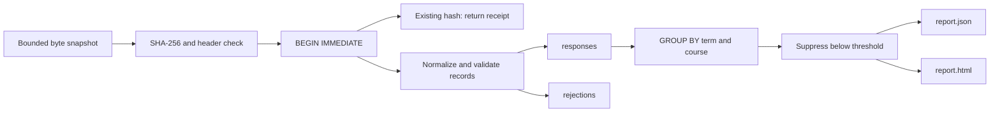

# SurveyLens technical manual

## Purpose and first principles

SurveyLens turns a CSV snapshot into a repeatable local report. ETL means extract, transform, and load: read bytes, validate and normalize answers, then insert accepted answers into SQLite. A quarantine is a diagnostic table for rejected records, not a second store of their raw contents. Idempotency means replaying an input does not count its answers again.

This is an independent learning project using synthetic course evaluations. There is no login, server, student information system integration, or scheduled job. The operating system controls access to the local database. Small-group suppression reduces what this particular report displays; it is not anonymization. Response-level data remains in SQLite, and course/term labels remain in suppressed report rows.

Start with [pipeline.py](../surveylens/pipeline.py), then [the CLI](../surveylens/__main__.py), [render.py](../surveylens/render.py), and [tests](../tests/test_pipeline.py). These four files contain the implementation, orchestration, output, and executable examples.

## Reproduce the complete feature walkthrough

Use Python 3.11+ from the repository root. No runtime dependencies, credentials, environment variables, or services are needed. Choose a new temporary directory so the commands never mix with an existing database:

```sh
python3 -m unittest discover -s tests -v
DEMO_DIR="$(mktemp -d)"
python3 -m surveylens demo --output "$DEMO_DIR/demo"
python3 -m surveylens ingest surveylens/data/evaluations.csv --db "$DEMO_DIR/surveys.sqlite"
python3 -m surveylens ingest surveylens/data/evaluations.csv --db "$DEMO_DIR/surveys.sqlite"
python3 -m surveylens report --db "$DEMO_DIR/surveys.sqlite" --output "$DEMO_DIR/report" --minimum 5
```

The fixture produces 13 accepted responses, one normalized duplicate, and three rejections. The second persistent ingest returns `replayed: true` with the original receipt's counts. It does not add another run. Open the resulting `report.html`: CS101 has six answers, a 3.83 mean and 66.7% favorable; ENG201 has five, 4.00 and 80.0%; ART105's count and scores are hidden. Favorable means rating 4 or 5. It does **not** mean participation rate: there is no enrollment denominator.

The demo uses a temporary database, closes it, and removes it when finished; report files remain in the requested output directory. The persistent workflow keeps the database. Reports overwrite `report.json` and `report.html` in their output directory; choose separate directories to retain snapshots.

Optional installed-package workflow:

```sh
python3 -m venv .venv
. .venv/bin/activate
python -m pip install .
cd "$(mktemp -d)"
surveylens demo
```

Installation can fetch setuptools. The last two commands verify that the entry point and bundled CSV work outside the checkout. [pyproject.toml](../pyproject.toml) declares Python compatibility, the console script, and CSV package data. CI exercises both direct execution and this installation path.

## File map and flow

| Path | Responsibility |
| --- | --- |
| [surveylens/pipeline.py](../surveylens/pipeline.py) | Schema, immutable `Response`, validation, transactional imports, reporting queries |
| [surveylens/__main__.py](../surveylens/__main__.py) | Argument parsing, database lifetime, JSON stdout, exit codes |
| [surveylens/render.py](../surveylens/render.py) | One aggregate payload rendered as JSON and escaped HTML |
| [surveylens/data/evaluations.csv](../surveylens/data/evaluations.csv) | Synthetic happy and failure cases |
| [examples/output](../examples/output) | Checked-in sample output |
| [tests/test_pipeline.py](../tests/test_pipeline.py) | Temporary database, failure injection, subprocess CLI tests |
| [.github/workflows/ci.yml](../.github/workflows/ci.yml) | Python 3.11–3.14 tests, demo, installation smoke test |
| [EXERCISES.md](../EXERCISES.md) | Further discussion and practice |



The snapshot is read once, at most 25 MiB plus one byte for the size check. This guarantees the hash describes the bytes parsed even if the source file changes later. It costs memory proportional to the input size. UTF-8 with an optional BOM is accepted. `strict=True` CSV parsing rejects broken quoting; the parser also has a field-size limit independent of the total file limit.

## Contracts and database schema

The CSV header must contain exactly `response_id,course,term,rating,submitted_at`, in any order, without duplicate columns. Each data record must have the correct column count. Whitespace around values is stripped.

| Value | Canonical representation |
| --- | --- |
| Response ID | 1–80 ASCII letters, digits, `_` or `-`; case preserved |
| Course | Uppercase; 1–40 characters, first alphanumeric, then alphanumeric/`.`/`_`/`-` |
| Term | Lowercase `20YY-spring`, `20YY-summer`, or `20YY-fall` |
| Rating | One integer digit from 1 through 5 |
| Submission | Explicit timezone required; normalized to UTC ISO text |

`Response` is a frozen dataclass: normalized answers are represented as values that should not change after validation. Two timestamp spellings describing the same instant normalize to the same stored text. An ID is a key, not evidence of a person's identity; synthetic identifiers are appropriate for this repository.

`connect()` enables foreign keys and write-ahead logging (WAL). WAL allows readers to continue while a writer appends changes; it does not make SQLite a distributed database.

| Table | Keys and fields | Meaning |
| --- | --- | --- |
| `runs` | Integer `id`; unique `file_hash`; `imported_at`; accepted/duplicates/rejected counters | Import receipt, one per committed byte snapshot |
| `responses` | Text primary key `response_id`; course, term, rating, submitted_at; foreign key `run_id` | Canonical accepted answers; SQL check restricts ratings to 1–5 |
| `rejections` | Integer `id`; foreign key `run_id`; record_number and reason | Diagnostic reason only; never a copy of the source record |

An index on `(term, course)` supports aggregation. SQL parameters bind input values rather than concatenating them into statements.

Import begins with `BEGIN IMMEDIATE` before looking up the hash, serializing writers so two concurrent copies cannot both treat an input as new. An existing ID with identical canonical values increments duplicates; different values increment rejections with `conflicting_response_id`. The original answer is retained. A row-level validation failure allows other valid rows to be accepted. A CSV parsing or database failure rolls back **the entire run**, including earlier rows and diagnostics.

The first receipt includes ID, hash, counters and `replayed: false`; a replay also includes the stored `imported_at` field. The CLI adds rejection reasons. Consumers should not assume identical key sets between first import and replay.

Report JSON has `minimum_responses` and an ordered `groups` array. Each group has term, course, suppressed, responses, mean_rating, and favorable_pct. Groups below the threshold have `null` for **all three numeric values**. Threshold must be an integer at least three; default is five. Equal-to-threshold groups are visible. Mean is rounded to two decimal places; favorable percentage to one. HTML escapes course and term text, so labels cannot become markup.

## Tests, failure labs, and diagnosis

The unittest suite covers the fixture, cross-file duplicates/conflicts, timezone normalization, malformed headers, redacted diagnostics, SQL-trigger-induced failure and rollback, malformed CSV rollback, invalid encoding, suppression boundaries, rendering, and the real CLI. There is no separate lint or type-check configuration. Type hints assist readers but are not runtime enforcement.

Run focused failure labs using only the temporary database created above:

1. **Missing database:** `python3 -m surveylens report --db "$DEMO_DIR/missing.sqlite"`. Expect exit 2 and “run ingest first”; no new empty database is created by this command.
2. **Too-small threshold:** report with `--minimum 2`. Expect exit 2, no successful report export. Existing output from an earlier run may still be present; do not confuse it with a new report.
3. **Malformed record after good data:** `python3 -m unittest discover -s tests -k malformed -v`. Expect a passing regression that observes zero runs and zero responses after the parser aborts.
4. **Database failure:** run the `database_failure` test selector. It creates a temporary SQLite trigger that aborts an insert, proves rollback, removes the trigger, and imports successfully.
5. **Replay versus duplicate:** append a newline to a copy of the fixture and import it. The new bytes produce a new hash, but normalized response IDs still prevent double-counting. A changed file need not add new accepted answers.

CLI errors go to stderr with a `surveylens:` prefix and status 2; successful receipts go to stdout. A zero status can include quarantined records, so inspect `rejected`. For “database is locked,” identify another writer holding a transaction. Do not delete WAL files as a repair technique. For unexpected averages, inspect accepted answers and grouping keys; quarantined rows never reach aggregation. For unexpectedly suppressed data, check the requested minimum and the valid response count, not the number of source rows.

## Maintainer decisions and extension exercises

The standard library and local SQL make each step inspectable. The project intentionally has no distributed ingestion, migrations framework, user management, or statistical inference. `connect()` creates missing tables but does not migrate incompatible existing schemas. JSON and HTML are written sequentially, not atomically as a pair; a disk failure may leave one file updated. The database remains the report source of truth.

**Exercise: add a term filter.** Add `--term` to the report parser and an optional `term` argument to `report`. Validate using the existing term rule, use `WHERE term = ?` before `GROUP BY`, and retain the suppression step. Solution check: an absent term returns an empty group list, an existing term agrees with the unfiltered subset, and a hostile string never changes SQL structure.

**Exercise: publish a rejection-count summary.** Aggregate `rejections.reason` with `COUNT(*)` for a selected run. Keep raw values out of messages. Solution check: the fixture's three rejected records are represented by their reason codes and do not expose row contents. Do not publish group-specific rejection counts without considering disclosure risks.

**Exercise: support larger inputs.** A naive streaming hash plus a later parse can read different bytes. A sound solution stages one immutable file, hashes and parses that staged snapshot, then commits its manifest with the receipt. Preserve rollback and cross-file duplicate tests before optimizing throughput.

## Interview questions with answers

- **Why both file hashes and response IDs?** Hashes cheaply recognize exact replays. IDs enforce answer uniqueness even when a file is reordered or reformatted.
- **Why not overwrite conflicting answers?** That would silently rewrite history and make repeatable reports depend on import order. A correction feature needs an explicit policy and audit trail.
- **Why begin the transaction before the replay lookup?** Otherwise two writers can race between lookup and insertion.
- **Does suppression guarantee privacy?** No. Labels remain visible, local answers remain accessible, and repeated or overlapping reports can leak information.
- **Why store timezone-normalized text?** Equivalent timestamps compare consistently and are easy to inspect; SQLite does not supply a dedicated timezone-aware datetime type here.
- **What would production require?** A justified data policy, access controls, retention/deletion procedures, migrations, backups, operational monitoring, and a disclosure review. These are outside the implemented learning scope.
